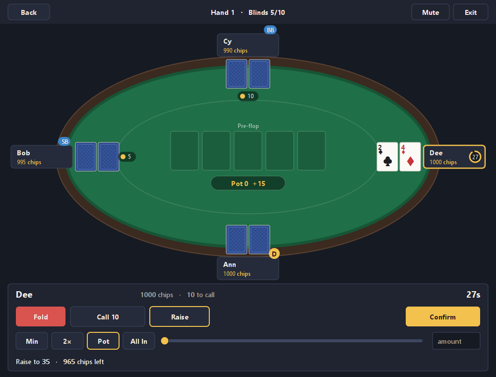
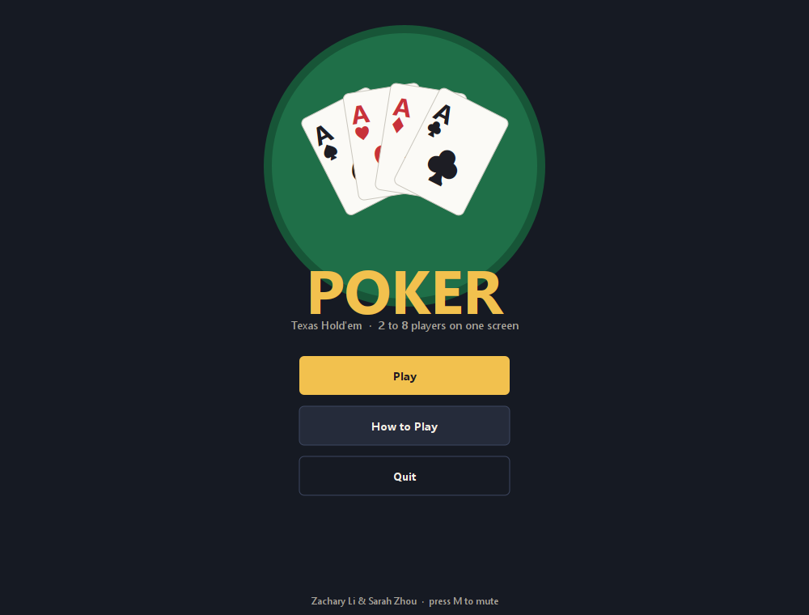
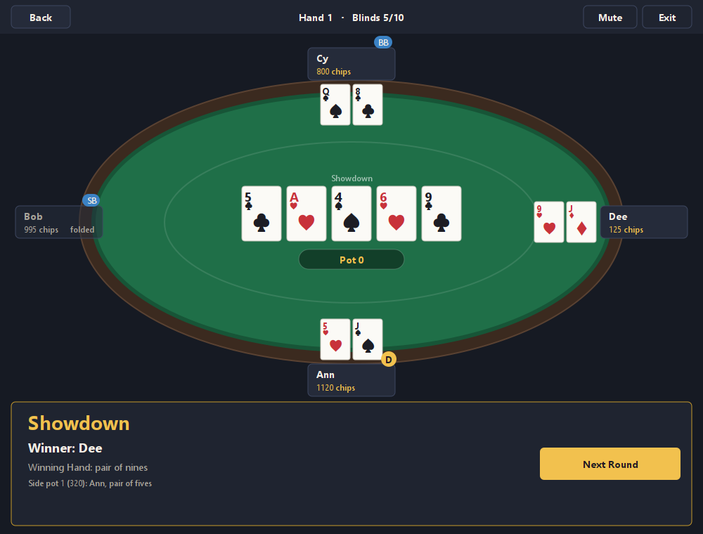

# Texas Hold'em Poker

[](https://github.com/zacharyli293680/grade-11-culminating-project/actions/workflows/build.yml)

A hot-seat Texas Hold'em game for 2 to 8 players on one screen, written in plain Java with no
dependencies beyond the JDK. The whole interface is drawn in code with Java2D, and the rules
engine is separate from the screens and covered by tests.

<p align="center">
  
</p>

## Features

- **Full Hold'em rules.** Blinds, a rotating dealer button, correct pre-flop and post-flop
  action order, heads-up rules, the big-blind option, minimum bets and raises, all-ins,
  side pots, uncalled bets returned, and split pots with the odd chip to the first seat left
  of the button.
- **Real hand ranking.** Best five cards out of seven, with every tie broken by kickers.
- **Hot-seat play.** Players share one device. Cards stay hidden until a player presses
  Start, and hide again after they confirm an action.
- **Elimination and a winner.** A player who runs out of chips is out; the last one with
  chips wins the game.
- **Turn clock.** 30 seconds per decision. On zero the player checks if they can,
  otherwise folds.
- **Clean, resizable interface.** Seats are placed for the actual player count, the table
  rescales with the window, and cards are drawn as vector graphics so they stay crisp.
- **Sound.** Background music and a click sound, with M to mute.

<p align="center">
  
  
</p>

## Getting started

You need a JDK, version 17 or newer. Nothing else is required.

```sh
# Linux, macOS, or Git Bash on Windows
sh scripts/build.sh    # compiles, runs the rule tests, builds dist/poker.jar
sh scripts/run.sh      # starts the game (builds first if needed)
```

```bat
rem Windows command prompt
scripts\build.bat
scripts\run.bat
```

Or by hand:

```sh
javac -d out/main src/main/java/poker/*.java
java -cp "out/main:src/main/resources" poker.Poker      # use ; instead of : on Windows
```

## How to play

1. Press **Play**, pick the number of players, and type names into the boxes (blank boxes
   become Player 1, Player 2, and so on). Press **Start Game**.
2. The panel at the bottom says whose turn it is. Pass the device to that player, who
   presses **Start my turn** (or Enter) to reveal their cards.
3. Choose **Fold**, **Check / Call**, or **Bet / Raise**. Raising opens a second row with
   Min, 2×, Pot, All In, a slider, and an amount box. The line under the buttons previews
   what you will put in and what you will have left.
4. Press **Confirm** (or Enter). The cards hide and the panel asks for the next player.
5. At the end of a hand the panel shows the winner, the winning hand, and any side pots.
   Press **Next Round** to deal again.

**Back** returns to the menu and discards the game. **Exit** or closing the window quits.
**M** or the **Mute** button silences the music and click sound.

## Project layout

```
src/main/java/poker/
  Poker.java          window and host panel: current screen, sound, turn clock, input
  Game.java           all Hold'em rules: blinds, action order, betting, all-ins, side pots,
                      showdown, elimination
  HandEvaluator.java  best five-card hand out of seven, with kicker comparison
  Player.java         one seat's chips, bets, cards, and status
  Screen.java         interface each screen implements
  MenuScreen.java, SetupScreen.java, AboutScreen.java, TableScreen.java
  TableLayout.java    seat, card, pot, and panel geometry from the window size
  Theme.java          colours, fonts, and drawing helpers
  CardPainter.java    card faces, backs, and empty slots at any size
  UiButton.java, UiTextField.java, UiSlider.java   code-drawn widgets
src/main/resources/sounds/   music.wav, click.wav
src/test/java/poker/
  PokerTests.java     rule and evaluator checks, no graphics needed
  RenderScreens.java  paints every screen to PNG for layout checks
scripts/              build and run scripts for Unix shells and Windows
docs/screenshots/     the images used on this page
```

The rules engine (`Game`, `Player`, `HandEvaluator`) has no dependency on the screens, so
it can be driven from tests or from a different front end. Cards are plain integers from
0 to 51: rank is `card % 13` (0 is a two, 12 is an ace) and suit is `card / 13`.

## Tests

`scripts/build.sh` runs the rule tests. They cover hand ranking (including the wheel,
six-card flushes, and kicker ties), blind posting and action order, raise sizing and caps,
short all-ins, side pots, uncalled bets, split pots with an odd chip, elimination, and
game over. To run them on their own after building:

```sh
java -cp "out/main:out/test:src/main/resources" poker.PokerTests
```

`RenderScreens` draws every screen and several table states to PNG files without opening a
window, which is how the layout is checked on the CI runner:

```sh
java -Djava.awt.headless=true -cp "out/main:out/test:src/main/resources" poker.RenderScreens
```

## About

This started as the ICS-3U (Grade 11 Computer Science) culminating project by
**Zachary Li** and **Sarah Zhou**, submitted January 22, 2024. The original version had a
Photoshop-drawn interface and a text-based rules engine. It has since been extended with the
missing rules (blinds, side pots, elimination, a timer), a rewritten hand evaluator, and a
code-drawn interface.

One deliberate simplification remains: any raise reopens the action for every player, even an
undersized all-in. Strict rules would not let a player who has already acted re-raise in that
case.
